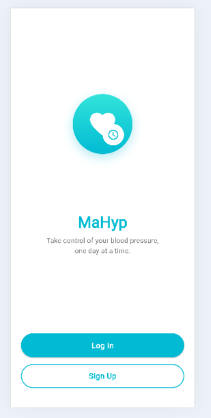
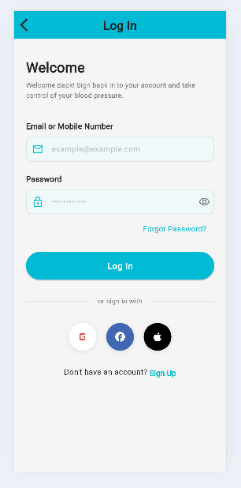
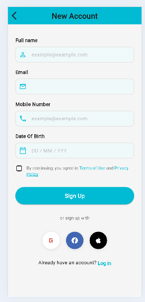

# 🫀 MaHyp - Hypertension Self Management App

<div align="center">


**Empowering elderly users to take control of their blood pressure, one day at a time.**

[](https://flutter.dev)
[](https://dart.dev)
[](LICENSE)
[](CONTRIBUTING.md)

[Features](#-features) • [Tech Stack](#-tech-stack) • [Getting Started](#-getting-started) • [Architecture](#-architecture) • [Contributing](#-contributing)

</div>

---

## 📖 About The Project

MaHyp is a mobile health application designed primarily for elderly users to manage hypertension effectively. The app provides an intuitive, accessible interface with large text, clear icons, and smooth interactions to help users track their blood pressure, medications, and appointments.

### 🎯 Project Goals

- **Accessibility First**: Designed for elderly users with larger touch targets (48dp+), high contrast UI, and simplified navigation
- **Easy Tracking**: Simple blood pressure logging with visual trends and insights
- **Medication Management**: Never miss a dose with smart reminders
- **Health Insights**: Personalized recommendations based on BP readings
- **Emergency Support**: Quick access to emergency contacts and information

---

## ✨ Current Features

- [x] Splash Screem
- [x] Onboarding Page
- [x] Email/Password login
- [x] Social authentication (Google, Facebook, Apple)
- [x] Secure password creation with strength validation

## 🛠 Tech Stack

### Frontend (Mobile)
- **Framework**: [Flutter](https://flutter.dev) 3.0+
- **Language**: [Dart](https://dart.dev) 3.0+
- **State Management**: [Riverpod](https://riverpod.dev) 2.4+
- **Navigation**: [GoRouter](https://pub.dev/packages/go_router) 13.0+
- **UI Components**: Custom widgets with Material Design 3

### Backend
- **Runtime**: [Node.js](https://nodejs.org)
- **Framework**: Express.js (planned)
- **Database**: MongoDB (planned)
- **Authentication**: JWT + OAuth2.0 (planned)

### Development Tools
- **Version Control**: Git & GitHub
- **Design**: Figma
- **API Testing**: Postman (planned)
- **CI/CD**: GitHub Actions (planned)

---

## 🚀 Getting Started

### Prerequisites

Before you begin, ensure you have the following installed:

- **Flutter SDK** (3.0 or higher)
  ```bash
  flutter --version
  ```
- **Dart SDK** (3.0 or higher)
- **Android Studio** or **Xcode** (for iOS development)
- **Git**
- **Node.js** (16+ for backend development)

### Installation

1. **Clone the repository**
   ```bash
   git clone https://github.com/Quirkydude/mahyp-app.git
   cd mahyp-app
   ```

2. **Install Flutter dependencies**
   ```bash
   flutter pub get
   ```

4. **Run the app**
   ```bash
   # For Android
   flutter run

   # For iOS (macOS only)
   flutter run -d ios

   # For Web
   flutter run -d chrome
   ```

### Environment Setup

1. **Check Flutter environment**
   ```bash
   flutter doctor
   ```

2. **Enable required platforms**
   ```bash
   # For web
   flutter config --enable-web

   # For desktop (optional)
   flutter config --enable-macos-desktop
   flutter config --enable-windows-desktop
   flutter config --enable-linux-desktop
   ```

---

## 📁 Project Structure

```
mahyp_app/
├── lib/
│   ├── core/                      # Core application functionality
│   │   ├── constants/             # App constants (colors, dimensions, text styles)
│   │   ├── theme/                 # Theme configuration
│   │   ├── router/                # Navigation setup
│   │   ├── utils/                 # Utility functions
│   │   └── network/               # API client setup
│   │
│   ├── features/                  # Feature modules
│   │   ├── splash/                # Splash screen
│   │   ├── onboarding/            # Onboarding flow
│   │   ├── auth/                  # Authentication
│   │   │   ├── data/              # Data layer (repositories, models)
│   │   │   ├── domain/            # Business logic (entities, use cases)
│   │   │   └── presentation/      # UI layer (pages, widgets, providers)
│   │   └── home/                  # Home dashboard (planned)
│   │
│   ├── shared/                    # Shared resources
│   │   ├── widgets/               # Reusable widgets
│   │   └── models/                # Shared data models
│   │
│   └── main.dart                  # Application entry point
│
├── assets/                        # Static assets
│   ├── images/                    # Images and logos
│   ├── icons/                     # Custom icons
│   └── fonts/                     # Custom fonts
│
├── test/                          # Unit and widget tests
├── integration_test/              # Integration tests (planned)
└── pubspec.yaml                   # Project dependencies
```

### Architecture Pattern

We follow **Clean Architecture** principles:

```
Presentation Layer (UI)
        ↓
Domain Layer (Business Logic)
        ↓
Data Layer (Repositories & API)
```

**Benefits:**
- ✅ Separation of concerns
- ✅ Testability
- ✅ Maintainability
- ✅ Scalability
- ✅ Independent of frameworks

---

## 🎨 Design System

### Color Palette

```dart
Primary Gradient: #33E4DB → #00BBD3
Background: #F5F5F5
Text Primary: #212121
Text Secondary: #757575
Success: #4CAF50
Error: #F44336
```

### Typography

All text sizes are optimized for elderly users:

- **Headings**: 32px - 20px
- **Body Text**: 18px - 14px (larger than standard)
- **Button Text**: 18px
- **Minimum Touch Target**: 48x48dp

### Accessibility Features

- ✅ High contrast ratios (WCAG AA compliant)
- ✅ Large, readable fonts
- ✅ Clear, simple navigation
- ✅ Intuitive icons with labels
- ✅ Smooth, non-jarring animations
- ✅ Screen reader support (planned)

---

## 🧪 Testing

### Run Tests

```bash
# Run all tests
flutter test

# Run tests with coverage
flutter test --coverage

# Run specific test file
flutter test test/features/auth/login_test.dart
```

### Test Structure

```
test/
├── core/
│   └── utils/
├── features/
│   ├── auth/
│   └── home/
└── shared/
    └── widgets/
```

---

## 📦 Dependencies

### Main Dependencies

| Package | Version | Purpose |
|---------|---------|---------|
| flutter_riverpod | ^2.4.9 | State management |
| go_router | ^13.0.0 | Navigation |
| flutter_svg | ^2.0.9 | SVG rendering |
| dio | ^5.4.0 | HTTP client |
| shared_preferences | ^2.2.2 | Local storage |

### Dev Dependencies

| Package | Version | Purpose |
|---------|---------|---------|
| flutter_test | SDK | Testing framework |
| flutter_lints | ^3.0.0 | Linting rules |

See [pubspec.yaml](pubspec.yaml) for the complete list.

---

## 🔧 Configuration

### App Configuration Files

1. **Theme**: `lib/core/theme/app_theme.dart`
2. **Colors**: `lib/core/constants/app_colors.dart`
3. **Routes**: `lib/core/router/app_router.dart`
4. **Constants**: `lib/core/constants/app_dimensions.dart`


## 🤝 Contributing

We welcome contributions! Please follow these steps:

1. **Fork the repository**
2. **Create a feature branch**
   ```bash
   git checkout -b feature/AmazingFeature
   ```
3. **Commit your changes**
   ```bash
   git commit -m 'Add some AmazingFeature'
   ```
4. **Push to the branch**
   ```bash
   git push origin feature/AmazingFeature
   ```
5. **Open a Pull Request**

### Coding Standards

- Follow [Effective Dart](https://dart.dev/guides/language/effective-dart) guidelines
- Use meaningful variable and function names
- Write comments for complex logic
- Maintain consistent formatting (use `flutter format`)
- Write tests for new features
- Update documentation when needed

### Commit Message Convention

We follow [Conventional Commits](https://www.conventionalcommits.org/):

```
feat: add blood pressure tracking
fix: resolve login validation issue
docs: update README with setup instructions
style: format code according to dart standards
refactor: reorganize auth module structure
test: add unit tests for login page
chore: update dependencies
```

---

## 🐛 Bug Reports & Feature Requests

### Reporting Bugs

If you find a bug, please create an issue with:

- **Bug description**: Clear and concise description
- **Steps to reproduce**: How to trigger the bug
- **Expected behavior**: What should happen
- **Actual behavior**: What actually happens
- **Screenshots**: If applicable
- **Environment**: Device, OS version, Flutter version

### Requesting Features

We love new ideas! Please create an issue with:

- **Feature description**: What you'd like to see
- **Use case**: Why this feature is needed
- **Proposed solution**: How you envision it working

---

## 📱 Screenshots

<div align="center">


### Onboarding


### Login & Sign Up
 

</div>

---

## 📅 Roadmap - TO BE DONE LATERR

## 👥 Team

| Role | Name | GitHub |
|------|------|--------|
| Developer | Clement Obeng | [@Quirkydude](https://github.com/Quirkydude) |
| Developer | Joel | [@Joel](https://github.com/Joel) |

---

## 📄 License

This project is licensed under the MIT License - see the [LICENSE](LICENSE) file for details.

---

## 🙏 Acknowledgments

- Flutter team for the amazing framework
- Design inspiration from modern health apps
- Open source community for excellent packages
- Our users for valuable feedback

---

## 📞 Contact

**Project Link**: [https://github.com/Quirkydude/mahyp-app](https://github.com/Quirkydude/mahyp-app)

**Email**: clementobeng333@gmail.com

---

<div align="center">

**Built with ❤️ for healthier lives**

⭐ Star us on GitHub — it motivates us a lot!

</div>